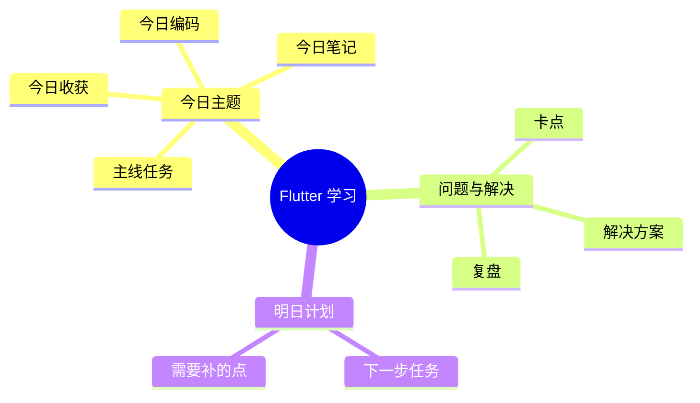

# Flutter 学习打卡表 / 进度表

## 使用方式

- 每天学习后打一次卡
- 每天记录：**编码内容、笔记、学习记录、问题与解决方案**
- 每周末做一次小复盘
- 每完成一个阶段，就更新一次“当前进度”
- 建议和 `Flutter学习计划.md`、`Flutter学习计划_30天.md`、`Flutter学习计划_30天_提示词版.md`、`Flutter学习打卡表_闯关版.md` 配合使用

---

## 个人信息

| 项目 | 内容 |
| --- | --- |
| 姓名 |  |
| 开始学习日期 |  |
| 当前阶段 |  |
| 当前项目 |  |
| 目标完成日期 |  |

---

## 进度总览

| 阶段 | 状态 | 完成度 | 说明 |
| --- | --- | --- | --- |
| 环境搭建 | ⬜ 未开始 | 0% | Flutter SDK、IDE、模拟器、运行成功 |
| Dart 基础 | ⬜ 未开始 | 0% | 变量、函数、类、空安全、异步 |
| Widget 与布局 | ⬜ 未开始 | 0% | Scaffold、Row、Column、Stack、Expanded |
| 状态与交互 | ⬜ 未开始 | 0% | setState、表单、页面跳转、列表 |
| 网络与数据 | ⬜ 未开始 | 0% | Future、dio、JSON、loading/error/empty |
| 综合项目 | ⬜ 未开始 | 0% | 完成一个可展示的小项目 |
| 打包与复盘 | ⬜ 未开始 | 0% | 打包、优化、总结、作品整理 |

---

## 每日打卡表

| 日期 | 今日学习内容 | 今日编码产出 | 今日笔记 | 学习记录 | 是否完成 | 遇到的问题 | 解决方案 | 复盘要点 |
| --- | --- | --- | --- | --- | --- | --- | --- | --- |
| Day 1 |  |  |  |  | ⬜ |  |  |  |
| Day 2 |  |  |  |  | ⬜ |  |  |  |
| Day 3 |  |  |  |  | ⬜ |  |  |  |
| Day 4 |  |  |  |  | ⬜ |  |  |  |
| Day 5 |  |  |  |  | ⬜ |  |  |  |
| Day 6 |  |  |  |  | ⬜ |  |  |  |
| Day 7 | 周复盘 |  |  |  | ⬜ |  |  |  |
| Day 8 |  |  |  |  | ⬜ |  |  |  |
| Day 9 |  |  |  |  | ⬜ |  |  |  |
| Day 10 |  |  |  |  | ⬜ |  |  |  |
| Day 11 |  |  |  |  | ⬜ |  |  |  |
| Day 12 |  |  |  |  | ⬜ |  |  |  |
| Day 13 |  |  |  |  | ⬜ |  |  |  |
| Day 14 | 周复盘 |  |  |  | ⬜ |  |  |  |
| Day 15 |  |  |  |  | ⬜ |  |  |  |
| Day 16 |  |  |  |  | ⬜ |  |  |  |
| Day 17 |  |  |  |  | ⬜ |  |  |  |
| Day 18 |  |  |  |  | ⬜ |  |  |  |
| Day 19 |  |  |  |  | ⬜ |  |  |  |
| Day 20 |  |  |  |  | ⬜ |  |  |  |
| Day 21 | 周复盘 |  |  |  | ⬜ |  |  |  |
| Day 22 |  |  |  |  | ⬜ |  |  |  |
| Day 23 |  |  |  |  | ⬜ |  |  |  |
| Day 24 |  |  |  |  | ⬜ |  |  |  |
| Day 25 |  |  |  |  | ⬜ |  |  |  |
| Day 26 |  |  |  |  | ⬜ |  |  |  |
| Day 27 |  |  |  |  | ⬜ |  |  |  |
| Day 28 | 周复盘 |  |  |  | ⬜ |  |  |  |
| Day 29 |  |  |  |  | ⬜ |  |  |  |
| Day 30 | 最终复盘 |  |  |  | ⬜ |  |  |  |

---

## 每周复盘表

| 周次 | 本周学到的内容 | 本周编码成果 | 本周最难的点 | 已解决的问题 | 下周重点 |
| --- | --- | --- | --- | --- | --- |
| 第 1 周 |  |  |  |  |  |
| 第 2 周 |  |  |  |  |  |
| 第 3 周 |  |  |  |  |  |
| 第 4 周 |  |  |  |  |  |

---

## 技能掌握清单

### 1. 环境与工具
- [ ] Flutter SDK 安装成功
- [ ] `flutter doctor` 无关键错误
- [ ] 能运行第一个 Flutter 项目
- [ ] 能使用模拟器或真机调试

### 2. Dart 基础
- [ ] 会写变量、函数、类
- [ ] 理解空安全
- [ ] 理解 `Future`、`async/await`
- [ ] 能在 DartPad 中验证代码

### 3. Widget 与布局
- [ ] 理解 Widget 树
- [ ] 会用 `Container`、`Text`、`Image`、`Button`
- [ ] 会用 `Row`、`Column`、`Stack`、`Expanded`
- [ ] 能做出基础页面布局

### 4. 状态与交互
- [ ] 会用 `setState`
- [ ] 能做按钮点击与文本更新
- [ ] 能做表单输入与校验
- [ ] 能做页面跳转与传参

### 5. 数据与网络
- [ ] 会发起网络请求
- [ ] 会解析 JSON
- [ ] 会处理 loading / error / empty
- [ ] 会做简单本地存储

### 6. 项目与工程化
- [ ] 能拆分组件
- [ ] 能整理目录结构
- [ ] 能做一个完整小项目
- [ ] 能打包与复盘

---

## 个人问题记录

| 日期 | 问题 | 原因 | 解决方案 | 是否掌握 |
| --- | --- | --- | --- | --- |
|  |  |  |  | ⬜ |
|  |  |  |  | ⬜ |
|  |  |  |  | ⬜ |

---

## 日常学习笔记模板

### 1. 今日编码
- 我今天写了什么代码：
- 新增了哪些页面 / 组件 / 逻辑：
- 运行结果是否正常：

### 2. 今日笔记
- 今天学到的概念：
- 我对这个概念的理解：
- 和 Web 的类比：

### 3. 今日学习记录
- 今天学习的时间：
- 今天遇到的卡点：
- 今天怎么解决的：
- 明天要继续补什么：

### 4. 今日复盘
- 今天真正掌握了什么：
- 今天只是看懂但还不会写的是什么：
- 今天最值得记住的一个坑：

---

## 脑图生成区

### 方式一：Mermaid Mindmap

### 方式二：每日脑图节点模板

- 今日主题
  - 核心概念
  - 今日代码
  - 今日问题
  - 今日解决方案
  - 今日收获
  - 明日计划

---

## 本月目标

- 本月最重要的目标：
- 本月完成的小项目：
- 本月最值得复盘的经验：

---

## 备注

这份打卡表的核心不是“填满”，而是帮助你持续看到自己从“会看懂”变成“能独立做”。

如果你每天都记录编码、笔记、学习过程，并顺手整理成脑图节点，你的学习资料会自动沉淀成可复盘、可检索、可分享的知识库。
