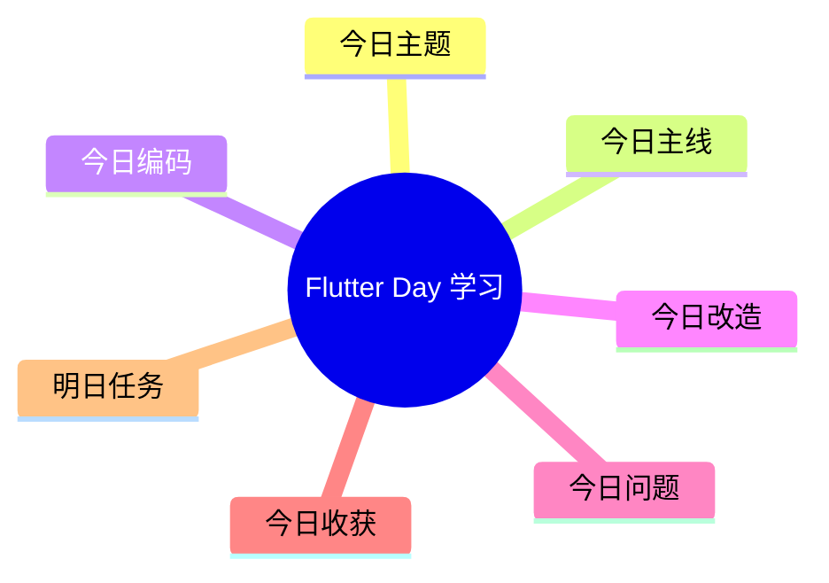

# Flutter 学习每日模板（实践优先版）

> 用法：每天复制这份模板，文件命名建议：`2026-04-19-Flutter-Day01.md`

---

## 基本信息

- 日期：
- Day：
- 今日主题：
- 今日主线任务：
- 今日加分任务：
- 今日挑战任务：

---

## 今日状态

- 今日心情：🙂 / 😐 / 😣 / 😎
- 今日专注度：1 / 2 / 3 / 4 / 5
- 今日学习时长：
- 今日 XP：
- 连续打卡天数：

---

## 今日编码

- 我今天写了什么代码：
- 新增了哪些页面 / 组件 / 逻辑：
- 运行结果：通过 / 未通过

### 关键代码

```dart
// 今天最关键的一段代码
```

---

## 今日改造

- 我对昨天的内容做了哪些修改：
- 我复用了哪些前一天的知识：
- 我今天新增了哪些交互 / 样式 / 数据：

---

## 今日问题

- 今天卡在哪：
- 我怎么修的：
- 我还没完全懂什么：

---

## 今日收获

- 今天真正学会了什么：
- 今天最值得记住的一个坑：
- 明天继续做什么：

---

## 明日任务

- [ ] 明天主线任务
- [ ] 明天加分任务
- [ ] 明天挑战任务

---

## 今日脑图大纲

- Flutter 学习
  - 今日主题
  - 今日主线
  - 今日编码
  - 今日改造
  - 今日问题
  - 今日收获
  - 明日任务

---

## Mermaid 脑图


