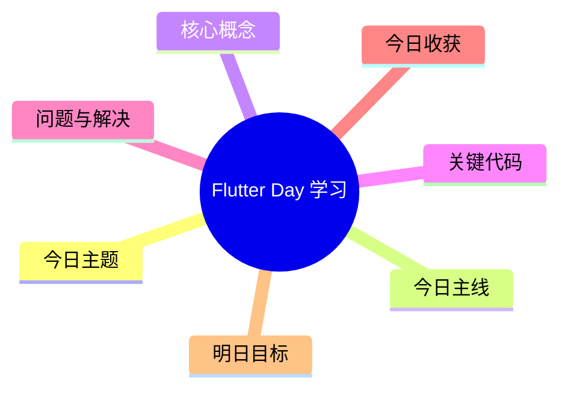

# Flutter 学习每日模板（Obsidian）

> 用法：每天复制这份模板，文件命名建议：`2026-04-19-Flutter-Day01.md`

---

## 基本信息

- 日期：
- Day：
- 章节：
- 今日主题：
- 今日主线任务：
- 今日加分任务：
- 今日挑战任务：

---

## 学习状态

- 今日心情：🙂 / 😐 / 😣 / 😎
- 今日专注度：1 / 2 / 3 / 4 / 5
- 今日难度感：1 / 2 / 3 / 4 / 5
- 今日学习时长：
- 今日 XP：
- 连续打卡天数：

---

## 今日编码

- 我今天写了什么代码：
- 新增了哪些页面 / 组件 / 逻辑：
- 运行结果：通过 / 未通过
- 对应文件路径：

### 关键代码片段

```dart
// 今日最关键的一段代码
```

---

## 今日笔记

- 今天学到的核心概念：
- 我的理解（用自己的话）：
- 和 Web 的类比：
- 这个概念在项目里通常用在：

---

## 今日问题与解决

### 问题 1
- 现象：
- 可能原因：
- 排查步骤：
- 最终解决方案：
- 是否真正掌握：是 / 否

### 问题 2
- 现象：
- 可能原因：
- 排查步骤：
- 最终解决方案：
- 是否真正掌握：是 / 否

---

## 今日复盘（3 分钟版）

- 今天真正掌握了什么：
- 今天只是看懂但还不会写的是什么：
- 今天最值得记住的一个坑：
- 明天准备优先补什么：

---

## 明日行动清单

- [ ] 明日主线任务
- [ ] 明日加分任务
- [ ] 明日挑战任务
- [ ] 明日复盘

---

## 脑图大纲（可直接导出）

- Flutter 学习
  - Day
  - 今日主题
  - 今日主线
  - 核心概念
  - 关键代码
  - 问题与解决
  - 今日收获
  - 明日目标

---

## Mermaid 脑图模板


